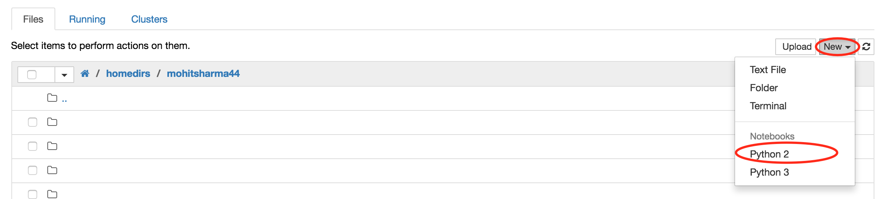
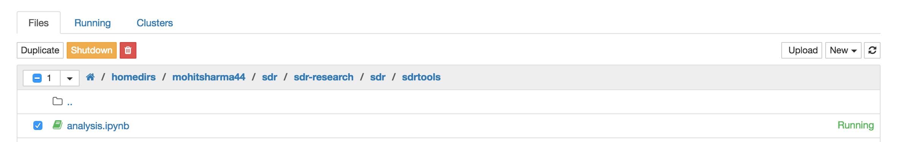

## 00 - 00 Introduction to Python


----------------
## Python

`Python` is a great object-oriented, interpreted, and interactive programming language. It is widely used as general-purpose, high-level programming language. It is ranked among the [`top 5 programming languages`](http://spectrum.ieee.org/computing/software/the-2016-top-programming-languages) in the world. 

Python was conceived in the late 1980s as a teaching and scripting language and has since become an essential tool for many programmers, engineers, researchers, and data scientists across academia and industry. It can be used to create many things including web applications, desktop applications, as scripting interpreter and most relevant for you -- as a data analysis tool.. whether it is about '*making sense*' of the dataset that you are working with, scraping and cleaning the publicly available datasets or simply automating a task.. you will find python to be very agile to fit your needs. 

The reason python python is so versatile and widely used is because its simple and easy to learn syntax and due to the availability of a large ecosystem containing domain specific tools that have been built using it.

> There are no type declarations of variables, parameters, functions, or methods in source code. This makes the code short and flexible, and you lose the compile-time type checking of the source code.

> Python tracks the types of all values at runtime and flags code that does not make sense as it runs.

Before we proceed further with learning the python syntax, lets familiarize ourselves with the environment that we will be using.

## 00 - 01 Introduction to Jupyter Notebook

#### What is a Notebook
The Juputer notebook (successor of Ipython notebook) is a web based interactive computational environment which provides a unique combination of code, shell environment and text. The Ipython notebook project that started of as a tool to provide the above mentioned functionalities just for python has since grown to be language agnostic supporting over 40 different languages and is now known as Jupyter notebook (or simply notebook). Simply put, a Jupter notebook is a [JSON](http://www.json.org/) document containing an ordered list of input/output cells which can contain code, text, mathematics, plots and rich media.

The Jupyter Notebook combines three components:
- **The notebook web application:** An interactive web application for writing and running code interactively and authoring notebook documents.
- **Kernels:** Separate processes started by the notebook web application that runs user's code in a given language and returns output back to the notebook web application. The kernel also handles things like computations for interactive widgets, tab completion and introspection. 
> - The Jupyter notebook, for running python codes, runs an ipython kernel.
> - If you are viewing this document on CUSP CDF and if you run any code, the code is not executed on your local machine. It is executed on the CDF server.. where the ipython kernel is running.
- **Notebook documents:** Self-contained documents that contain a representation of all the contents visible in the notebook web application, including inputs and outputs of the computations, narrative text, equations, images, and rich media representations of objects. Each notebook document has its own kernel.

#### Why do we even use a notebook instead of .. lets say .. a terminal or some text editor?
The notebook web application enables users to:
- Edit code in the browser, with automatic syntax highlighting, indentation, and tab completion/introspection.
- Run code from the browser, with the results of computations attached to the code which generated them.
- See the results of computations with rich media representations, such as HTML, $LaTeX$, PNG, SVG, PDF, etc.
- Create and use interactive JavaScript widgets, which bind interactive user interface controls and visualizations to reactive kernel side computations.
- Author narrative text using the Markdown markup language.
- Build hierarchical documents that are organized into sections with different levels of headings.
- Use different cell types, for example, to include mathematical equations using $LaTeX$ syntax in Markdown, which are rendered in-browser by MathJax.

#### DIfferent Cell Types?
Notebooks consist of a linear sequence of cells. There are four basic cell types:
- **Code cells:** Input and output of live code that is run in the kernel
- **Markdown cells:** Narrative text with embedded LaTeX equations
- **Heading cells:** 6 levels of hierarchical organization and formatting
- **Raw cells:** Unformatted text that is included, without modification, when notebooks are converted to different formats using nbconvert
These cell types can be viewed by clicking `Cell -> Cell Type` in menu bar

#### Working with Notebook
> This section will assume that you are using CUSP CDF. However following along on your local installation should be trivial.

##### Dashboard
Once you have logged in to the jupyter hub, you should see a dashboard. The dashboard serves as a home page for the notebook displaying the notebooks and files in the current directory.

##### New Notebook
Once you navigate to your home directories (from where you have opened this notebook), you can create a new notebook by clicking on New on top right corner and selecting `Python 2` or `Python 3`

>UCSL bootcamp will be compatible with Python2 as well as Python3

Jupyter Notebook has a modal user interface. This means that the keyboard does different things depending on which mode the Notebook is in. There are two modes: **Edit** mode and **Command** mode.

- ##### Edit Mode
Edit mode is indicated by a green (or some different color than when you are not editing the cell) cell border and a prompt showing in the editor area. When a cell is in edit mode, you can type into the cell, like a normal text editor. To enter the edit mode, navigate to the cell and press `Enter`

- ##### Command Mode
Command mode is indicated by a grey cell border with a blue (or some different color than when you are editing the cell) left margin. To enter into command mode, press `Esc` key. This will bring you out of the edit mode


- ##### Keyboard Shortcuts
In command mode, the keyboard is mapped to a set of shortcuts that let you perform notebook and cell actions efficiently.
Its recommended learning the command mode shortcuts in the following rough order:
- Basic navigation: enter, shift-enter, up/k, down/j
- Saving the notebook: s
- Change Cell types: y, m, 1-6, t (markdown in this case)
- Cell creation: a, b
- Cell editing: x, c, v, d, z
- Kernel operations: i, 0 (press twice)<br><br>
This will help speed up your development time.
To know more about keyboard shortcuts, click: `Help -> Keyboard Shortcuts` in the menu bar

##### Closing and Deleting a Notebook
The notebooks that are currently open are shown in green icon on dashboard page. The notebooks will remain running until you explicitly shut them down. To do that, check the box next to the notebook that you want to close and observe the controls on top of the notebook.

- To close the notebook, you can click on the `shutdown` button
- To remove/ delete the notebook you can click on *recycle bin* next to the shutdown option

> ##### At this stage, I would advise taking some time and familiarizing yourselves with the Notebook, UI and Cell shortcuts. 

### 00 - 02 Introduction to Python Syntax

The syntax of the Python programming language is the set of rules that defines how a Python program will be written and interpreted by the system (and by yourself). Python was designed to be a highly readable language. It has uncluttered visual layout and uses English keywords frequently. Python aims towards simplicity and generality in the design of its syntax. 

In fact Python's syntax guidelines are encapsulated in the mantra "There should be one and preferably only one obvious way to do it". You can read more about it in [`The Zen of Python`](www.python.org/dev/peps/pep-0020/ 'The Zen of Python').

#### Indentation
Python provides no braces to indicate blocks of code. Blocks of code are denoted by line indentation. The number of spaces or tabs in an indentation is variable but it is rigidly enforced. For example,


```python
a = 12
if a == 12:
    print("a is 12 :) ")
else:
    print("a is not 12 :( ")
```

    a is 12 :) 


If I don't respect the indentation, let's say, in else block of code.. let's see what happens


```python
a = 12
if a == 12:
    print("a is 12 :) ")
else:
print ("a is not 12 :( ")
```


      File "<ipython-input-2-22237de9583e>", line 5
        print ("a is not 12 :( ")
            ^
    IndentationError: expected an indented block


> Note: (python) Notebooks automatically indent your code so you don't have to. However when you write your own code in a regular text editor or in an [idle](https://docs.python.org/3/library/idle.html), make sure to indent your code.

> Note: Cross-platform compatibility note: because of the nature of text editors on non-UNIX platforms, it is unwise to use a mixture of spaces and tabs for the indentation in a single source file. It should also be noted that different platforms may explicitly limit the maximum indentation level.

Thus, if we want to add any more lines in the condition blocks, the lines should all have same level of indentation inside if block or else block.

#### Multi-line Statements
Statements in Python typically ends with a new line. However python allows the use of the line continuation character ( \ ) to denote that the line should continue. For example:


```python
a = "Hello 
World"
print(a)
```


      File "<ipython-input-3-8498df2221f9>", line 1
        a = "Hello
                  ^
    SyntaxError: EOL while scanning string literal


```python
a = "Hello \
World"
print(a)
```

    Hello World


The above is an explicit line joining technique
Another way to tell python not to end is by putting the strings or variables within the brackets ( ), { }, [ ] without using the line continuation character. For example:


```python
num = ['one', 'two', 'three'
       'four', 'five']
num
```


    ['one', 'two', 'threefour', 'five']


This is known as implicit line joining technique.

> Did you notice, to print the variable `num`, I didn't use `print` function? This is possible only in notebook or other repl environments but won't work in the stand-alone code that you will write later
> The different brackets mean different things. We will study about them in later chapters. This is just to demonstrate a way of using multi-line statements.

#### Quotations
You must have seen that in the above examples. we have used single and double quotes. Python accepts single, double and triple (''' or """)quotes to denote string literals. Bear in mind that the start quote and end quote should be of same type. Strings are generally created by using single or double quotes (python treats single and double quotes as the same.) Triple quotes are used when the string literals span across multiple lines. Consider following examples:


```python
name = 'UCSL'
instructor = "Mohit"
description = '''The UCSL at CUSP is a series of online sessions designed to build a 
common skillset and familiarity with techniques, concepts, and models for 
urban informatics computing. The online sessions focus on data explorations, 
programming skills and statistical methods needed for scientific computing 
in the field of Urban Informatics.'''
```


```python
print(name)
print(instructor)
print(description)
```

    UCSL
    Mohit
    The UCSL at CUSP is a series of online sessions designed to build a 
    common skillset and familiarity with techniques, concepts, and models for 
    urban informatics computing. The online sessions focus on data explorations, 
    programming skills and statistical methods needed for scientific computing 
    in the field of Urban Informatics.


#### Comments
Comments are the statements that are not evaluated by python. It is generally used for improving the readability/ understanding of what the code does. There are basically 3 ways of doing it
- ##### Block Comments
Block comments generally apply to some (or all) code that follows them, and are indented to the same level as that code. Each line of a block comment starts with a `#` and a single space. Paragraphs inside a block comment are separated by a line containing a single `#`. 
> You can replace `#` by putting the comment inside `'''` in a **non repl** environment


```python
# I wont be evaluated
a = 12
a
```


    12


- ##### Inline Comments
An inline comment is a comment on the same line as a statement. Inline comments should be separated by at least two spaces from the statement. They should start with a # and a single space. Inline comments are unnecessary and in fact distracting if they state the obvious.


```python
x = 100  # Setting x to 100 (this is unnecessary)
```

##### Docstrings
Every function that you write should be accompanied with a Docstring that tells about the function.

Docstrings are written between a triple quote (""" ...< docstring >...""").
> We'll learn about functions a bit later.. and will enforce having docstrings there.


```python
def my_func():
    """
    This function will
    perform .....
    """
    pass
```


```python
my_func.__doc__
```


    '\n    This function will\n    perform .....\n    '


> docstrings are also printed when you type < `function_name` \> `?`. Go ahead.. try typing `my_func?` on the next line.


```python

```
