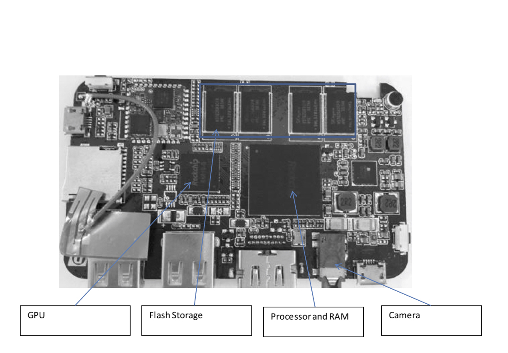
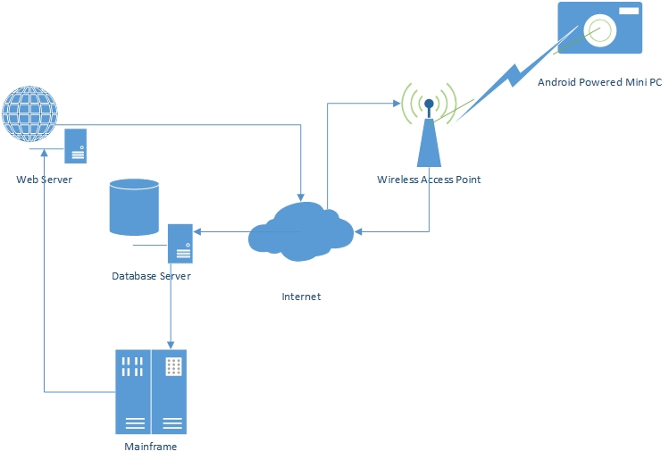
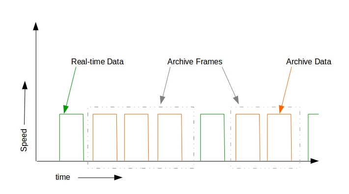
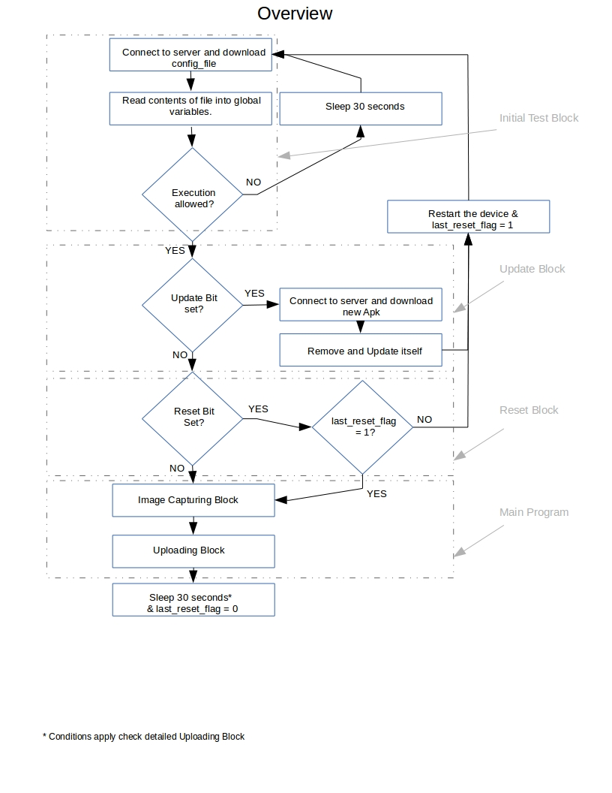
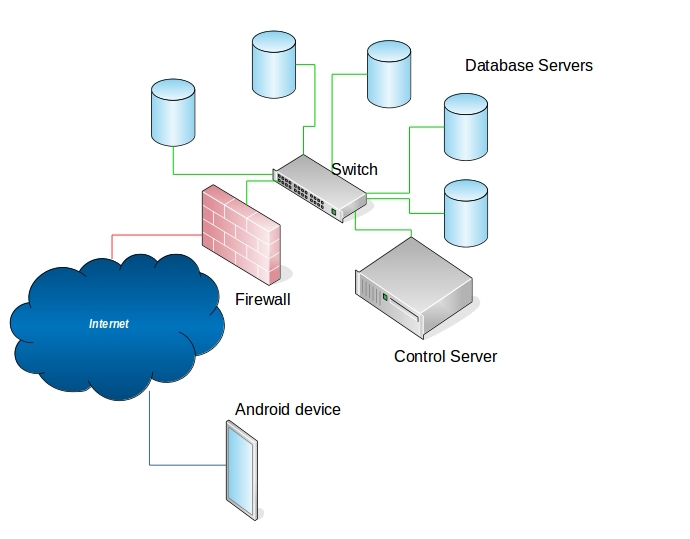
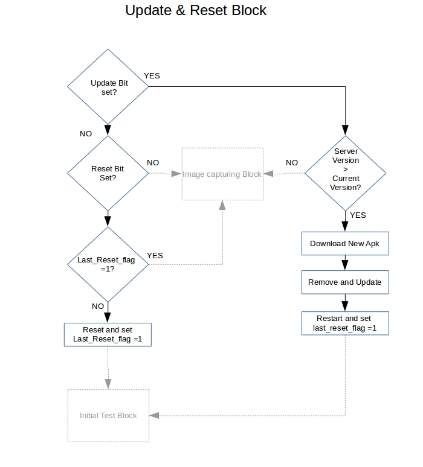

## Abstract:
Today we are at the cusp of having computing systems in the urban
environment as an integral part of urban design. Looking across urban
domains of infrastructure, environment and its inhabitants, the goal of
this project in general is to create access to information about urban
systems phenomena.
Infrastructure and environment synoptic imagery provides fascinating
insight into the operation of the city. The low cost high coverage offer
the opportunity to place multiple miniature sensors that can cover large
portions of the city. Through this approach, the individual domain
functions and their interdependencies can be observed. modelled and
understood. To understand the city as a system, encircling the people in
the society and their behaviour towards its infrastructure and design,
we are developing and refining the methods of observing, recording and
analysing the city. Here we propose a cost effective proposal for
persistent and synoptic observation of the city. We present the
challenges we faced and overcame in designing the initial network
framework for this set up.


## Introduction

Instrumenting the city requires new ways of thinking about the design
and the existing technologies that can be blended together with the
existing urban infrastructure. Currently we have a few research
organizations that are trying to capture the macroscopic city
observables using very high resolution cameras set up at multiple
vantage points in the city. Vantage points in this context are the high
rise buildings providing an unobstructed view of the city. They however
fail to observe the parts of the cities that are obstructed by the next
high rise building in the field of view, thus masking the buildings
behind it and hence the researchers in the field of urban science have
tended to investigate experiences in specific parts of urban city rather
than studying the properties of the city as a whole. We propose an
integrated and comprehensive solution to this problem.
The method of observing the city in this proposal also highlights one of
the most important parameter in urban science, ’Citizen Participation’

## Mini PC’s

Majority of the sensors placed at multiple vantage points consists of
optical light sensors which captures images at a certain rate and are
then passed through image processing pipelines to mask out private and
personal information to comply with the privacy rules since these high
resolution camera’s provide a very high granular information of the
objects in its field of view. These images are then transmitted to the
research labs or some data warehouse where these images sit till they
are required to perform certain analysis. However, it is certain that
the entire process requires a good amount of computing power especially
the post processing of the data acquired from the sensors. To add to the
complexity, these high performance servers also need to be physically
secured and if any component of the entire system fails, it needs to be
fixed on the location itself. On the other hand there is an on-chip
integration of a variety of functional hardware blocks to suit a
specific product application.\
A system on Chip (SoC) is an integrated circuit that integrates all
components of a computer and other electronics into a single chip. An
SoC can be as simple as an analogue to digital converter for a
microphone or as complex as a cellphone. The SoC integration that we
propose to use for our process is almost equivalent to the requirements
of that of a computer. We are using one of the chips that integrates a
powerful quad core 1.2GHZ processor, 2GB of Main memory, 8GB of
secondary memory and a 5MP camera with an HDMI port for external display
as shown in Figure 1.\
These mini PCs run android operating system thus the application
software developed for this device is executable on any decent hardware
architecture running android operating system v.4.2.2 and above.


<center>Figure 1: Android Mini PC</center>

## Architecture

To comply with the IRB and HIPAA privacy rules, we have to make sure
that the data being acquired should not be accessible to the public
before the data has been processed to make it fit for public release.
Thus encryption and secure channel are two of the most important
parameters on transmission end, integrity of the data throughout the
transmission and authenticity and reliability at the receiving end
because the entire data is routed through public internet. We will be
using two step authentication, primary authentication for authenticating
the communication link and secondary authentication for authenticating
the device that is sending the data\
The high level view of the entire architecture and flow of data can be
schematically explained as:\


<center>Figure 2: Flow of data in Citysynth</center>

### Transmission

The transmission section of the architecture consists of mainly remote
sensing, encryption of data and secure transmission of the data. We have
developed an android application which takes into consideration all of
the above parameters at the transmitting end.\
Apart from security, we also need to make sure about following things:\

1.  ***Semi-Automation***: We need to semi-automate the working of the
    device and centralize the control parameters making sure that these
    commands cannot be intercepted by other rogue device. This is an
    important part since the devices can be placed at vantage points, on
    the windows of residential buildings and maybe other remote places
    where physical human interaction for changing certain parameters
    will not be possible.

2.  ***Resilient to freezes and crash***: We need to make the
    application resilient to freezes and crashes in case of a hardware
    or a software problem. We also need to design the application such
    that it can wake itself if device reboots due to power loss for
    certain amount of time.

3.  ***Smart Monitoring of resources***: The application needs to be
    smart enough to identify the Wi-Fi networks around it and get
    connected to the volunteer’s access point programmatically. Since we
    need to prevent any direct user interaction with the device, we
    implement a simple technique for getting connected to the wireless
    access and will be explained later. The application should be able
    to detect changes in the wireless connectivity to the internet. It
    should dynamically adapt to these conditions and accordingly
    conserve its resources to keep capturing the images upto its maximum
    potential and then wait till it gets the wireless access to the
    internet back.

4.  ***Prevent hogging the network***: We need to make sure that if the
    device is placed on the window of the volunteer’s residence, it
    should not hog their network when uploading the data. We have
    devised two techniques which works in coherence with the control
    server at the cusp headquarters, dynamically managing the network
    resources and making optimum use without creating a bottleneck in
    the system.

5.  ***Provide the location and latency information***: The device needs
    to identify the coarse location based on the IP address of the
    user’s Network Address Translation or based on the gps co-ordinate
    if the device has a gps receiver in built. This information along
    with the Media Access Control address needs to be transmitted to the
    control server for secondary identification of the device.\
    The application also needs to compute the latency in the network for
    the time period of data transmission so that the server can process
    this information and utilize the consumer’s network
    bandwidth efficiently.

6.  ***Encryption and secure channel***: The application needs to
    encrypt the data that it captures and should create a secure channel
    between the device and the control server/ database server for
    uploading the files making sure that other rogue devices cannot
    intercept the information being transmitted through the
    secure channel.


**Semi-Automation**

Once these devices are deployed, we might want to change certain device
parameters or application’s execution parameters. The ideal way is to
set up a remote control access to these mini pc’s. However, the ideal
way is not the best way for us when we look at it from security
perspective. If we talk about remote control, we have two ways to
achieve remote control:

- Secure remote control

- Virtual network computing.

Having a secure remote control of the device would require us to have
the device on our network through secure shell, and then get tunnelled
to the workstation where it can be controlled from. This process is very
resource intensive and not always a good idea. We are taking utmost
precaution when it comes to security but if we tunnel the device through
the firewalls of cusp and if attackers, down the line, are able to find
a vulnerability, they can cause much more damage to cusp than just
getting access to the camera.\
If we look at the second case, VNC uses remote frame buffer protocol
(RFB) to communicate with other devices by transmitting keystrokes and
mouse events and relays the graphical screen updates back. VNC is the
ideal remote control access technique since vnc does not require a vnc
server to have a display attached to it which is exactly our case,
however the drawback is the protocol that it uses for controlling the
remote devices. RFB is not a secure protocol, though it does not
transmit password in plain-text format, cracking the password could be
successful if both encryption key and passwords are sniffed from the
network. Newer versions of vnc such as ultra vnc and tight vnc do offer
authentication based on NTLM and Active directory user accounts and all
the communications are AES encrypted with their commercial packages but
again one of the major drawback here is that tight vnc doesn’t offer
encryption on the picture images that are being transmitted which we
would really like to have. We are testing these techniques for further
implementation but looking at the current security scenario, we had to
find an alternative that would allow semi-centralized control of the
device from cusp head-quarters.\
We suggest controlling the device using a configuration file kept on the
control server. The device would set up a network connection with the
server through secure shell v2 using 256 bit AES encryption key. Once it
gets connected to the server, it will request for the main configuration
file that will contain list of commands that the device and application
would require to execute. By default if the file does not exist on the
server, the device will terminate the session and check back in 30
seconds on a separate session.\
The device downloads the configuration file, reads and stores the
control parameters in its local memory. Once it gets the information, it
re-names the file on the control server so that unless there are any new
changes made in the configuration file, it doesn’t have to read the old
file. This saves significant amount of execution time of the
application. This technique also makes sure that in-case the control
server goes down, or if the network connection goes down at the device
end, it can still collect images with the information it acquired from
the last most recent configuration file.

**Resilient to freezes and crash**

The more we rely on mobile applications for taking care of the business,
the greater the need for reliability. Worst still, Murphy’s Law usually
sees to it that the timing is never good.\
An application crash often occurs when the application doesn’t work the
way it should. There can be many reasons behind it, such as memory
corruption, buffer overflow. Though utmost precaution has been taken by
us to prevent such occurrence but again, if something can go wrong, it
will!\
To circumvent this problem we have created an option to remotely restart
the device in case the device stops sending the data to the database
server.\
The second most popular reason for device not being able to send the
data is due to an error in acquiring a lock onto hardware that is being
used by some other process temporarily. This causes the application to
crash. There is nothing much we can do if the application crashes due to
this reason. We can however make sure that the application wakes itself
up and start its execution after a certain time period. This makes the
device auto recover from many crashes that might occur in its life
cycle.

**Smart Monitoring of Resources**

We are relying on the citizen’s personal wireless internet access point
to set up bidirectional communication with the device. There can be
times when we might lose internet connection due to wireless access
point malfunction, power loss or worst some serious network breakdown
which can happen due to some catastrophic activity. The activities
taking place in the surrounding at such times would be one of the most
important data set that the urban science researchers will be interested
in, thus we somehow need to make sure that till the time the device is
powered it should efficiently manage its resources and keep capturing as
much data as possible.\

**Prevent hogging the network**

As mentioned earlier, this is also a citizen science project. The users
won’t be interested in observing the city at the expense of having a
poor bandwidth access if our device uses a major chunk of their
bandwidth. Moreover the urban enthusiasts wont be interested in
accessing the old data, they are more interested in knowing about the
current details of the surrounding, thus the technique of uploading the
archived data has to be different compared to the method of uploading
the real-time information. The archived data is the data that was
collected when the wireless access to the internet was not available.
Our application is smart enough to detect when the Wi-Fi connection is
lost and change they way it executes the commands. The application on
detecting no Wi-Fi access, starts saving the data in a separate archive
location and keeps saving the images till the maximum threshold of the
device is not reached. During this type of execution the device does not
try to communicate with the server, instead it continues executing
according to the last most recent set of configuration commands that it
received. If the device storage reaches its maximum threshold, it stops
the flow of execution and waits for Wi-Fi access. Once the device gets
access to the Wi-Fi network, it starts the entire execution and uploads
the real-time data. Once the real-time data has been uploaded, the
application will check the archive location for presence of any files
that might have been archived. It will upload these archive files in
multiple frames according to the configuration file. The frame is
basically a collection of multiple files and the number of archive files
in a frame is set by the control server based on the network latency and
speed information that the device sends to the server. There can be a
case wherein the device lost the internet connection for multiple weeks
and it reached its maximum threshold limit. As soon as the internet
comes up, it will try to squeeze in as much data as possible to the
server, thus hogging the network and delaying the uploading of the
real-time data as well as causing inconvenience to the citizen in using
their internet connection. The idea is explained in the figure 3.\
Another problem that might happen when it gets Wi-Fi access is that
there might be no internet connection from the access point for the
device to reach to the control server for next set of information. Our
application will first try to communicate with the server, if it is not
able to establish a communication, the code will execute according to
the last most recent downloaded configuration file. If the application
is executing for the first time, and detects no internet connection, it
will not execute since by default the execution bit is set to zero.



<center>Figure 3: Transmission of realtime and archived data</center>


**Provide the location and latency information**

Our plan is to install these devices on vantage points and to give it to
citizens who would like to volunteer in contributing to the data. We
need to make sure that the device is being used for the purpose it was
build for and that it is facing exactly the direction we would like it
to be. Currently the device that we selected does not have built-in gps
receivers or assisted gps receiver system. If we plan to continue with
these devices, we need to make sure that these devices are placed
exactly at the location it is mean to be. We are identifying the
external ip address of the user’s NAT device so as to make sure that the
device is connected to the same location as the CPE device.\
The global ip address of the device is provided by the internet service
provider and will keep on changing. However what we are interested in is
the location associated with the ip address that is allocated. This
information is accessed by comparing the IP addresses against their
geo-location from online geo-location databases. Thus the devices that
do not have capability to get gps co-ordinates can also be used to
identify the location using the external ip address.\
MAC address of the device is also transmitted to the server which can be
used as secondary authentication by the server. Since MAC addresses in
theory cannot be manipulated, it is easy to check the received MAC
addresses against the MAC addresses of the devices that we have sent
out. Thus providing a second layer protection against rogue devices.\
Along with this information the device also calculates the time required
for transmission of packets to the server. Our technique will monitor
the speed and time for transmission of files and send this information
to the server. Based on this information the server will calculate the
latency and accordingly set the number of files to be sent in a frame
between transmission of two real-time data streams.

**Encryption and secure channel**

The data we are trying to collect will be obtained by using high
resolution optical sensors and this data needs to be handled
responsibly. The part of this project also involves crowd-crafting and
citizen participation, thus the data needs to go through certain image
processing pipeline to be fit for public release. We need to make sure
that the data should not be accessible by any one who has physical
access to the device. We have designed the entire application keeping
security and network optimization in mind.\
As soon as the device captures the image, the application captures the
byte stream data and before anything gets written to a file, it throws
the byte stream to a private handler which encrypts every byte using AES
encryption. AES encryption is considered by far the best symmetric
encryption technique due to its encryption complexity and speed. The
encryption process on the device is fast and since there is no key
exchange, the images can only be decrypted at cusp. The AES 128 bit
encryption performs substitution of bytes on table and then rows and
column transformation 10 times adding the 128 bit key after every
iteration. This makes the encryption strong enough to withstand
brute-force attacks. Once the encrypted file is stored, the application
creates a secure ssh aes encrypted channel and connects with the control
server. It downloads the second configuration file which is generated by
the control server providing address of the database server to which the
device needs to upload. The device creates a separate ssh session with
the database server and uploads the encrypted file along with other
files for authentication and identifying the location to database
server. Once the data is uploaded, the session is terminated.


<center>Figure 4: High level view of flow of entire application</center>

### Reception

Network management at receiving end is also of prime concern especially
looking at the future growth of the project. A single server can handle
communication with few tens of devices, but what when the project scales
up to hundreds of devices? A single server would get overwhelmed with
simultaneous requests and the server might crash. The case will even be
worse when the server would come back and has to accept more than just
real-time data since the devices will also start uploading the archived
data, bringing the whole communication infrastructure down. To overcome
with this problem we implement a SDN-like architecture for efficient
scaling of the project.

**SDN-like Architecture**

The SDN-like architecture for this project would consist of a control
server which is responsible for managing the data flow to individual
database servers. The devices communicates with the control server to
get the configuration files which holds the configuration information
for capturing images, changes to device parameters, and is also
responsible for calculating the latency of the network and accordingly
decides the number of archive files to be sent in a single frame.\
The control server receives hello messages once every two seconds from
the database servers along with the CPU, memory and network utilization.
On receiving this information the control server calculates which server
has less utilization and sends this information to the device. The
SDN-like architecture can be shown in figure 5. The device initially
communicates with the control server requesting the information of the
server to which it needs to send the data on receiving that information,
it initiates a handshake with corresponding database server, encrypts
the communication channel and uploads all the information. An extra
layer of security can also be added wherein the control server also
updates the known hosts file for individual database server and makes an
entry only for the device that is about to send the data and remove it
once the data has been uploaded. This will make sure that the database
server will only accept connection request from the client whose
information has been appended by the control server. This requires some
testing and research since these database servers might not be at the
cusp headquarters or inside the cusp’s private network. Best security
practices and techniques needs to be implemented before deploying this
security method.\


<center>Figure 5: SDN like architecture</center>

**Decryption**

The encrypted information might be kept encrypted unless there is a
requirement to use the information by researchers for analysis. Once the
request for accessing the data is processed, the set of images are
passed through the image processing pipeline where the images will be
decrypted byte-by-byte with the same 128 bit key which was used for
encryption. The images will be processed by the image processing
algorithm which will provide researchers with only the required amount
of information for analysis.\
The data that is being collected will also be sent by volunteering
citizens who are using our device thus we would also like to present the
processed images on the website to which they would have a password
protected access. The images would undergo decryption process in the
main frame server at cusp and the decrypted images will be processed by
image processing algorithm blurring out the windows and other sensitive
information and then shown on the website.

## Displaying processed data

The volunteering citizens might be interested in preliminary analysis
performed on the data that is being captured by the device that they
have set up at their residence. We know that visual methods can make the
point much stronger than simply describing the data, thus we need to
design a better way to visualize the analysis on the webiste. we also
need to provide a way for other citizens to volunteer for participating
in urban science.\
The ’Citysynth’ website design calls for users to access the website in
order to see the processed data. On the computation end, the images will
be processed by other algorithms that would provide certain information
like light pollution and energy efficiency of their neighbourhood and
probably a few steps that they can take to improve the community. These
algorithms are currently under development, but once developed, the
website would host all these information in an aesthetically pleasing
visual format empowering citizens with the information and probably the
steps that they should take to make the community a better place to
live.\
The website has to maintain security of the user information that is
being used for accepting joining request and login credentials that is
being entered for authentication.\
Though it is not important but we have designed the website in such a
way that the images cannot be downloaded by some of the common means
used for downloading data from the websites. The website details can be
split up into two parts *viz.*\

1.  Signup

2.  Home Page

### Signup

The first page of the website calls for user sign in or user sign up.
New york city volunteers interested in our citysynth project can sign up
here. Of all the required credentials needed to sign up, the important
ones are username, password and address. The registered users will not
be provided immediate access to the website. The address will be
verified in order to make sure it is not a fictitious address or an
already existing address. After the successful delivery of the image
capturing device, they will receive permission to access the website. If
the user has already signed up and has permission to access the web
page, the user will be navigated to the home-page of the website upon
signing in.\
No user account in the database is created unless all the required
credentials are filled up. The database credentials are kept in a file
in a secure server location to avoid security breach to these
credentials. The database values involved are database name, password to
database, domain name and database access privileges. One of the most
common threats to websites dealing with databases is SQL injection. SQL
injection can be used to inject malicious SQL statements into an entry
field for execution to dump the database contents to the attacker. The
user inputs are kept free of SQL injection attacks.\
To add to the security at the server end, the user login passwords are
not stored in clear text. They are stored as 60-character string in
hashed form. Hashing is the standard way of protecting a user’s password
before it’s stored in a database. The open-source phpass library is the
most secure way of storing passwords and the entire password hashed
password is salted. The default permission of user access is false and
even after creating a successful account, user access to processed
images is not provided.

### Home Page

After successful login, the home page is displayed. It displays a sample
processed data image and Google maps location of the various
image-capturing devices in place. A sample-processed image is shown to
communicate to the user that their privacy is not violated and the data
is used for research purposes.\
Google maps displays the location of the various devices in the city. To
put markers on the map, geo location is used. The control server appends
the IP addresses of all the devices to a common file. This file
containing all the IP addresses is converted into various latitudes and
longitudes by comparing them against the online geo-location database.
Additional data from the IP address is also obtained which helps in
locating the device as close as possible to the physical location of the
device on the map. These points are plotted on the map in form of
marker. Each location has information regarding the area, the field of
view and what the sensor is responsible for observing. a slideshow of
images is attached to those pins, which can be accessed by clicking on
them. Each device located around the city provides these slideshow of
images. To guide the user to the slideshow of images, on clicking the
marker the popup is displayed with all the above mentioned information
and a small slideshow of thumbnails of processed images which calls
another php page responsible for a full screen slideshow of images.\
The website is designed such that the visitor is not able to download
the images even though the link to the images on the server can be
viewed. If the link is separately accessed, the user is presented with a
blank screen without any image.

## Detailed execution of Code

The logical overview of the flow of entire application has been show in
above. Here we will explain the detailed working and the pseudo code for
the application on the device. The run cycle of the application can be
summed up in 10 steps *viz.*

1.  Get Connected to wireless access point.

2.  Check Wi-Fi connectivity and check archive storage location.

3.  Download main configuration file from server.

4.  Read the configuration files and modify application parameters.

5.  Check for execution permission and update command.

6.  Check for reboot command.

7.  Capture the Image.

8.  Download uploading configuration file.

9.  Identify the IP address and MAC address of the device.

10. Calculate the time consumed for successful transmission of the data.

### Getting Connected to Wifi

This application will be installed on the devices set up on the vantage
points as well as in the devices that will be given to the volunteers to
put up in their residence.\
We want to reduce the user interaction with the device and prevent
direct interaction as much as possible, however to get the data from
these devices we need to get access to the wireless access points and
get the device authenticated for it to communicate with the servers. The
user will be given a micro secure digital non volatile memory card. The
user can use this sd card and insert it in the laptop, tablet, personal
computers etc and open the wifi authentication application. The
application will ask the user for wifi name and password. Once the user
enters this information, the memory card will become write protected and
no other information can be placed on the memory card. The user has to
insert this card in the memory card slot of the device and turn on the
device. The application will boot after the device is completely booted
and will read the contents of the memory card for wireless service set
identifier, password combination and will get connected to it.
```
- Get access to the file with wifi credentials from memory card

- Create instance of $wifimanager$ class and access `wifi_service` method
to create a new wifi connection with the ssid and password read from the
string

- Set the `groupcipher`, `keymanagement`, and `protocol` based on
the type of Wi-Fi authentication being used
```

### Check Wi-Fi connectivity and check archive storage location

In this step, we need to make sure that the Wi-Fi connection that was
made in `step 1` is successful. This check is essential to make sure
that the connection is live and the data being captured is to be updated
in real-time and need not be archived.\
If the device is connected to the Wi-Fi, the application stores the data
in real-time location which gets uploaded once every 30 seconds to the
database server and on successful upload, the data is deleted from local
storage. However if the application detects that the Wi-Fi is not
connected, the application changes the storage location to archived
storage space. This helps application keep track of what needs to be
uploaded in real-time and when the internet comes back up, it can upload
the archive files in between the real-time transmission.
```
- Get instance of `ConnectivityManager` class and access
`Connectivity_Service` method to get the Wi-Fi status
```

### Download the main configuration file from the server

The application needs to set certain parameters of the application
before it starts execution. If these parameters are not received from
the server, the application will refuse to run and wait until it
receives those parameters.\
Once the configuration file is downloaded successfully the application
will re-name the file on the server. This is an indication that the file
has been read and the new commands and parameters will be considered
during the execution of the code.\
```
- Create ssh connection with the control server using the private
key pre-installed on the device

- Download the main configuration file on local storage
```

### Read the configuration files and modify the application parameters

The main configuration file consists of three most important parameters
related to device and seven parameters for the application to work
correctly.\
The three device related parameters are

`execute`

`update`

`restart`

The execute bit is the permission bit for the application to start
execution. By default the value is set to zero, once this bit is set,
the device will start capturing and uploading the data. The application
has system access on the device and can restart or update the
application. The restart bit by default is set to zero, if this bit is
changed, the device will restart once and resume normal operation.\
The update command requests the application to call a separate
application which is responsible for updating our application to a newer
version.\
The other contents of the configuration file are the control parameters
for the hardware for capturing the image. The following are the control
parameters for the camera:

`frames per minute`

`focus for the camera`

`white balance`

`zoom`

`quality`

`image size in width`

`image size in height`


`Get access to the file with wifi credentials from memory card`

### Check for the execution permission and update command

If we find that the device has been sending some corrupt data or if the
device has been pointed in the direction that we are not interested in
observing, there is an inbuilt mechanism to stop execution of the
application.Before the update command is executed, the local
configuration file is modified and the update bit is set to 0. This
ensures that if the device loses wireless access to the internet and is
not able to download new set of instructions, it should not keep on
trying to download the new version of the application during every
execution.\
The logical view of execution permission and update and reset bit can be
shown below:\

**Execution permission**

The execution bit from the main configuration file is checked as soon as
the application is called. If the device is not able to download the
configuration file or if the execution bit in the configuration file is
set to zero, the device will not execute for next 30 seconds. The device
will poll the control server for execution command once it wakes up, if
still not granted, the application will again sleep for 30 seconds.\

`Check the status of the execution bit from the main configuration file`

**Update command**

Updating the application is a process which requires un-installing the
old version and installing the new version of the device. This process
cannot be completed by the application which is about to be
un-installed, thus we have designed a separate application code for the
purpose of updating. The update application is called by the old version
of our application. This application is responsible for un-installing,
downloading the new version from the control server and installing it.
The last but most important step of the update application is to call
the updated version of our application and start it. Once our
application is executed, the update application is sent in the
background and is eventually killed by android.\
```
- Check the status of the update bit in the main configuration file

- Next algorithm for update application Ssh to the control server
and download the new version of the application
```


<center>Figure 6: Logical Flow for update and reset</center>

### Check for reboot command

There can be cases wherein the application is not able to execute of
crashed due to some hardware malfunction or software problem such as not
being able to obtain lock on the hardware. Though extreme measures have
been taken to prevent the application from crashing, but in case the
application crashes, there is an option to reboot the device from the
control station. The application has system privileges and it can
restart the device if the restart bit in the main configuration file is
set.\
Before the reboot command is executed, the local configuration file is
modified and the reboot bit is set to 0. This ensures that if the device
loses wireless access to the internet and is not able to download new
set of instructions, it should not keep on trying to download the new
version of the application during every execution.\

`Check the status of the Restart bit from the main configuration file`

### Capture the image

This is one of the most important piece of code in the entire
application since all the data capturing and encryption is performed in
this piece of code.\
The application reads the camera configuration parameters and sets them
once the camera is programmatically opened. After setting the
parameters, the camera takes an image and sends the raw information to a
private handler which does not deal with any of the code from main
class. The private handler calls the cipher activity and sends the byte
stream data for encryption. The data is encrypted by AES 128bit key and
is sent back to the private handler. The $cipheroutputstream$ is then
read byte by byte and flushed to a file in the storage location
mentioned in with the date and time stamp. Once the encrypted file is
written to the device, the private handler calls upload activity to
upload the images to the secure database server.\
During the encryption of the data, the application downloads the
uploading configuration file and a separate thread is created in the
background which uploads the encrypted images, ip and mac address and
time taken for transmitting the last image to the server.\
```
- `Camera.open` Set the camera
`focus`, `picture size`, `white balance`, `zoom` and `quality`

- Call `Camera.takepicture` and send the `bytestream` to a private handler Call
`camera.release` and Camera = null.

- Create a cipher and get instance of `AES`. Send the `bytestream` to
`cipheroutputstream` along with the cipher and encrypt the bytes.

- Ssh the control server and download the upload configuration file.

- Go to sleep for 30seconds.
```

### Download the uploading configuration file

The upload configuration file is created by the server based on the
hello message received by it from the database servers. The control
server calculates to which database server the data needs to get
uploaded to. The server write the information accordingly for each
device. The device downloads the data, reads the contents and uploads
the data to the mentioned server location.\
One of the most important field in upload configuration file is the
number of archive files that can be uploaded together as a frame. The
control server receives the information about the time taken to upload
the real-time data successfully. Based on this information and the frame
per minute field, the server computes the no. of files that can be
uploaded between two real-time data frames. The device reads this field
and creates a frame for uploading archive data.\
```
- Create ssh connection with the control server using the private
key pre-installed on the device.

- Download the upload configuration file on local storage
```

### Identify the IP address and Mac address of the device

We need to identify the coarse location of the device to make sure that
the device is in the same physical area that it is supposed to be. The
device that we are currently using does not have gps or assisted-gps
receiver built in. To get the location of the device however, we can get
the location of the NAT in the network by getting the IP address and
this will give a coarse location of the device. This information is also
helpful in placing the marker on the map present on the website.\
The IP address can be obtained by basically sending a request to a
server which can send the information about the ip address from which
the request came. For security reasons, we are accepting this
information only in javascipt object notation format which is basically
a text string printed on the website. We read this information to a file
and upload it to the database server along with other data.\
The MAC address is being acquired solely for secondary authentication
purpose. Once all the information is uploaded to the database server,
the MAC address can be used as a means to detect the authenticity of the
information being stored.\
```
- Create a thread Create object of `httpGet` class and get the
`HttpResponse` from the website in json format

- Get `Wifi_service` and the Mac address by calling `getMacAddress();`

- Store the IP and MAC information in a string and write it to a file
```

### Calculate the time consumed for successful transmission of the data

We need to calculate the time consumed for transmission of data to the
database server since this information will be used by the control
server to calculate the latency in the network and accordingly set the
parameters for uploading the archived files from the device.\
```
- Get the current time in milliseconds by calling
`System.currentTimeMillis();` and total number of bytes already
transmitted before the uploading function in is called by using
`TrafficStats.getTotalTxBytes();`

- Get the time in milliseconds and the total number of bytes
transmitted after the uploading function in is
executed as mentioned above Write the information to a file and queue it
for upload in the next execution cycle of the code
```

## Conclusion and Future scope

The scope of this project will increase as this starts getting deployed.
The data from this project correlated with other kind of data such as
demographics, meteorological conditions, seasons will provide insight
beyond the urban science. The information can be useful for emergency
responses, urban planning, and environmental monitoring. The devices
being used by us are miniature in size and cheaply available for them to
be deployed at multiple locations without worrying about the cost for
implementation. These devices can run on 5 volt DC supply continuously
or on battery power for few days. They don’t require any complicated
hardware or networking infrastructure to be designed and deployed to
start getting the data.\
The project is still in its initial stages of deployment and work is in
progress for designing image processing pipeline and visualization of
the received data so that the information received from these devices
can be made visually appealing. The new devices are being tested and the
code is being modified to make it robust against prospective crash which
can happen due to different reasons.\

## Acknowledgements

This project would not
have been possible without the kind support and help of our project
guide prof. Kang Xi.\
I am highly indebted to NYU and NYU CUSP for their guidance and constant
supervision as well as for providing necessary information regarding the
project and also for their support in completing the project.\
I would like to express my special gratitude and thanks to the Head of
Urban Observatory, Dr. Masoud Ghandehari for giving me such attention
and time. My thanks and appreciation also go to the Urban Observatory
research scientist Dr. Gregory Dobler who helped us in developing the
project.
