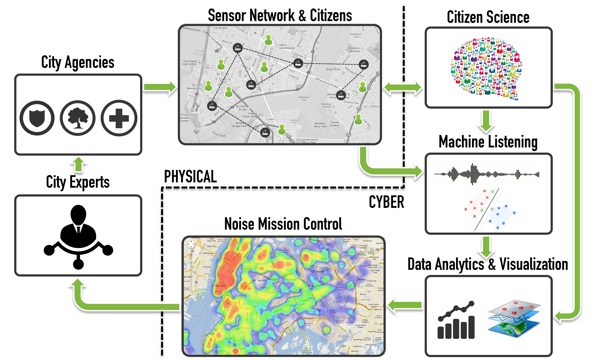

## Overview:

Noise pollution is one of the top most quality of life issues for urban residents in the United States. It has been estimated that 9 out of 10 adults in NYC are exposed to excessive noise levels. Such levels of exposure have proven effects on health causing sleep disruption, hypertension and so on. It is especially harmful for the children. Studies have proved that noise pollution leads to learning and cognitive impairment in children.

NYC has tried to regulate the sources of noise since 1930’s but just like other cities around the world, lacks the resources to systematically monitor noise pollution, enforce its mitigation and validate effectiveness of such actions.

Currently the city monitors the noise via its 311 service, which is for civil complaints and as of 2014 it receives about 400 noise complaint calls per day. Unfortunately the combination of limited human resources, transient nature of sound and relative low priority of the noise complaints causes slow or nonexistent responses.

In order to address these limitations, the objectives of our project is to create technological solutions for:

- Systematic and constant monitoring of noise pollution.

- Accurate description of acoustic environments in terms of its composing sources.

- Enabling the city agencies to take effective, information-driven action for noise mitigation.

We plan to achieve these objectives by implementing a novel CPS system that we call **SoNYC, Sounds of New York City**.

This system includes:

- A distributed network of sensors for large scale noise monitoring.

- These sensors make use of cutting-edge machine listening methods to constantly provide a rich description of their acoustic environment.

- Information from the network flows through a cyber infrastructure that analyzes, retrieves and visualizes the data to facilitate the identification of important patterns of noise pollution intended for decision makers at our partner city agencies to strategically deploy the human resources at their disposal to act on the physical world.

## Distributed Network of Sensors
For performing a large scale noise monitoring, we need a distributed network of sensors that can perform advanced processing to produce audio data up to city standards. We played around with different options such as:

- [`Tronsmart MK908ii`](http://www.geekbuying.com/item/Tronsmart-MK908II-RK3188-Cortex-A9-Quad-Core-1-6GHz-Google-Android-4-2-Mini-TV-BOX-2G-8G-BT-External-Wifi-Antenna-Black-318432.html):
This was a Quad Core 1.4GHz, Cortex-A9 based mini PC packing a whopping 2GB RAM, built-in Wi-Fi and running Android 4.1 (by default). We were able to unlock the boot loader and install custom Linux kernel which would allow us to run a headless version of Debian based OS.  Everything went fine until we started hitting problems with custom linux kernel that was installed. We started getting boot loops, kernel panics.. all this was basically taking me a lot of time to debug and.. it was just more daunting than it should have been especially given the fact that these sensors were soon to be deployed outside in remote locations that could not be accessed everyday for, let's say, performing kernel updates. We tried working with the device and even the company that manufactured it but soon they gave up stating "it can only run Android" and so did we after some time.
Believe me if there was any way we could achieve everything that we wanted to using Android (rather than using Linux), this would have been my definite choice

- [`Odroid C1+`](http://www.hardkernel.com/main/products/prdt_info.php?g_code=G143703355573):
This one was our second choice because of the beefy 1.7GHz ARM Cortex A7 processor and 1GB RAM. This guy came with default support for well known Linux based operating systems such as Arch and Ubuntu. For some reason we were having issues with the way kernel was handling audio data. After trying some tweaks we had to give up because soon we also started seeing issues with the [`edimax`](https://www.amazon.com/Edimax-EW-7811Un-150Mbps-Raspberry-Supports/dp/B003MTTJOY/ref=sr_1_1?ie=UTF8&qid=1469060992&sr=8-1&keywords=edimax) WiFi usb dongle that was connected to it.
Ofcourse, I don't blame those guys. After all this was their first attempt at low cost single board mini pc. However, I guess it was not meant to be in SONYC

- [`Raspberry pi 2`](https://www.raspberrypi.org/products/raspberry-pi-2-model-b/):
Who doesn't know these mini pcs. Probably one of the very few single board computers to have such a large developer and user base. These guys pack in a 900MHz quad-core ARM Cortex-A7 CPU and a 1 GB RAM. These come with a native [`raspbian`](https://www.raspbian.org/) os which is built up on Debian wheezy (and now Jessie).
Finally we had a sensor node that could perform our audio signal processing, provide reliable connectivity with off the shelf wifi dongles and a debian based OS which basically gave me liberty to write our codes in whatever language I preferred*.

> if you know me, you would know that my preferred language is (and will always be) Python 

I would like to boast a lot about this project but for the sake of length of this blog, I will stop rambling. However, if you are interested to know more about this project, you can visit: [**wp.nyu.edu/sonyc**](https://wp.nyu.edu/sonyc/) or [contact Me](http://sharmamohit.com/#contact)
