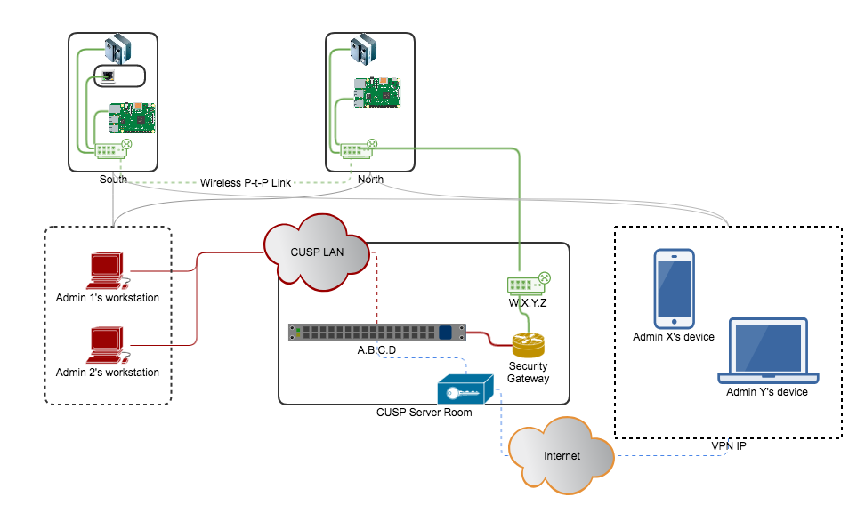

The aim of this project is to become a central control unit (CCU) to interface
with all the UO Imaging (and more) devices. The idea is that the cameras,
Pan and Tilt mechanisms, AutoFocussing systems and so on should
be controllable from a remote location via a simple CLI tool (with
auto-correct feature).

The code for this project is located in my Github repo thoughtfully named --
[UOController](https://github.com/Mohitsharma44/UOController)


The following diagram should make the idea more clear:



What I want is that the cameras / equipments marked as `South` and `North`
should be controllable via this CLI from either Admin's workstation or from
Admin's any trusted device (over VPN).


Currently this module interacts and controls that Thermographic FLIR A320 cameras
using custom [A320 library](https://github.com/Mohitsharma44/pyfrac/blob/master/pyfrac/acquire/capture.py)
that is a part of my [PyFRAC](https://sharmamohit.com/project/pyfrac) project
and with the [CUIC](https://sharmamohit.com/project/cuic) project.


Since I have written most of the other camera's driving modules in C/ C++, I am using
`rabbitmq-c`, a C library for rabbitmq to serve the RPC calls initiated by this CLI.
More information on this setup can be found in the [CUIC](https://sharmamohit.com/project/cuic)
project.

**Installation**

This module requires rabbitmq since it uses that as a broker. To install rabbitmq,
follow these steps:

``` bash
echo "Downloading erlang"
wget https://packages.erlang-solutions.com/erlang-solutions_1.0_all.deb

echo "Installing erlang-solutions"
sudo dpkg -i erlang-solutions_1.0_all.deb

echo "Updating package manager"
sudo apt-get update

echo "Installing erlang and erlang-nox"
sudo apt-get install erlang erlang-nox

echo "Adding rabbitmq to sources.list"
echo 'deb http://www.rabbitmq.com/debian/ testing main' | sudo tee /etc/apt/sources.list.d/rabbitmq.list
wget -O- https://www.rabbitmq.com/rabbitmq-release-signing-key.asc | sudo apt-key add -

echo "Updating package manager again"
sudo apt-get update
sudo apt-get install rabbitmq-server

echo "Adding Rabbitmq management web plugin and setting up default admin:admin user"
sudo rabbitmqctl add_user admin admin
sudo rabbitmqctl set_user_tags admin administrator
sudo rabbitmqctl set_permissions -p / admin ".*" ".*" ".*”
sudo rabbitmq-plugins enable rabbitmq_management

echo "Starting rabbitmq server"
sudo systemctl enable rabbitmq-server
sudo systemctl start rabbitmq-server
```


> _maybe I should just write an Ansible playbook for all this..._
>
>  _Hmm..._
