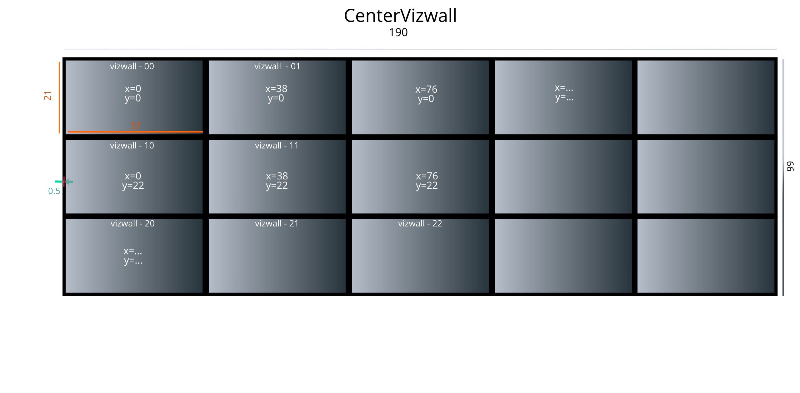

This project was a long time coming and in fact something that I have been waiting
to get my hands on. This project write up is basically about the proof of concept
work that I had to do in order to build a final 27 screen vizwall at NYU CUSP
for the Urban Observatory project. In this post, I will mention things that work
and the gotcha's that I came accross, and learned about, the hard way..


### Problem
At NYU CUSP, We had a room walled on 3 sides and floor to ceiling glass
door + window on the other side. The size of the two shorter walls were something like
6ft x 10ft (height) and the longer wall was ~15ft x 10ft (height). We wanted to
turn this into a vizwall that would cover all of the wall-space. (check the banner image)
A quote for a 3 x 3 configuration commercial vizwall was something ~$2000+
(mind you, not including the TV!). Now, I worked for a couple of university research
projects so money is not something we had in abundance. I had to come up with
some solution that would keep the price low and still be able to play videos
and project images (also, it needs to be configurable so that other researchers
can interact with this vizwall to showcase their project).


### Solution
Slap a Pi behind each TV screen and use broadcasting/multicasting with [PiWall](http://piwall.co.uk)
libraries!

> Disclaimer:
>
> - The following solution has been tested only using Pi 2B+, Pi 3B and Pi 3B+.
> - While the solution is not specific to Pi's and you can use any cheap Linux machine
> that is somehwat powerful (check the softwares that needs to run on Pi), this
> was the cheapest and reliable-ish option in my opinion.


This solution was not one of those, where you would simply plug in the Pi and
everything would "just work". *Heck, do things ever?*

## Hardware Required
Here is the list of hardware that you will need in order to build this project:

- *X* number of TV screens or Monitors.
- *X* client Raspberry Pi's (either Pi 2B+, 3B or 3B+). *(We purchased 27 [Rpi 3B](http://a.co/d/5CvVTJQ))*
- 1 Master Raspberry Pi (3B, preferably 3B+). *(We purchased 3 [Pi 3B+](http://a.co/d/bh18gd2) because our vizwall is split into two 6 and one 15 screen display)*
- 1 *X+1* port ethernet switch *(We purchased one [16 port Netgear GS316](http://a.co/d/aDVJEWj)
and 2 x [8 Port Netgear GS108](http://a.co/d/3YrqKcQ))*
- 1 WiFi capable switch. *(I had an existing Asus WiFi switch)*
- A Linux/ Mac laptop to perform initial setup for all the Pis.
- You will also need Memory cards to go with all the Pis. Make sure to buy at least
an 8GB Class 10 micro SD card. *(We used [Sandisk 16GB](http://a.co/d/3UnbOHR))*
- *X+1* Ethernet cables to connect the Pi's and your laptop to the switch.

> Note:
>
> - I will be controlling the Master Pi via WiFi. Please make sure to check the
> number of ports that will be required by you.

## Getting Started

### Setting up the Pis.
You need to flash the memory cards with the most recent version of [Raspbian Desktop](https://www.raspberrypi.org/downloads/raspbian/).
Once downloaded, I made the following changes:

- Open terminal and type `sudo raspi-config`
  - Change the hostname
  - Change password
  - Enable ssh
  - Change Ram/ GPU memory split to 256

- Change screen resolution (if required):
  - Click on start > Preferences > Raspberry Pi Configuration.
  - Click on the "Set Resolution”  and select `DMT mode 82 1920x1080`

- Hide the taskbar after Pi boots up
  - Click on start > panel settings > advanced
  - Set `hide when inactive` and `pixel size` = 0
  - Open new terminal and type `crontab -e` and
  add `@reboot sleep 10 && env DISPLAY=:0 XAUTHORITY=/home/pi/.Xauthority /usr/bin/xdotool mousemove 500 500` and save it.
  - Next, type `nano ~/.config/lxsession/LXDE-pi/autostart` and add
  `@unclutter -idle 0`

    > I know we haven't install xdotool and unclutter yet, lets just get the
    > configuration out of the way, we will install it after we setup the networking

- Remove unwanted packages from the Pi (this may not be required with newer versions of Raspbian):
  - Open terminal and type `sudo -i`
  - Next type `apt purge libreoffice wolfram-engine sonic-pi scratch -y && apt autoremove -y && apt update -y && apt upgrade -y`

- Backup measure for hiding the taskbar
  - In this, we will move the cursor programmatically away from taskbar

- Reboot the Pi: `sudo reboot now`

- Setting up the Network Configuration:
  - Add the WiFi configuration to the **Master Pi** only (you can add this to clients too if you want).
    - Open `/etc/wpa_supplicant/wpa_supplicant.conf` and add:

    ``` bash
    network={
    ssid="<your wifi name>"
    psk="<your super secret WiFi password>"
    }
    ```
  - Add the network configuration to `/etc/network/interfaces` file:

    ``` bash
    auto eth0
    iface eth0 inet static
    address 192.168.1.X
    netmask 255.255.255.0
    gateway 192.168.1.1
    broadcast 192.168.1.255

    #####
    # This is required for Master, Optional for clients
    allow-hotplug wlan0
    iface wlan0 inet dhcp
    wireless-power off
        wpa-conf /etc/wpa_supplicant/wpa_supplicant.conf
    #####
    up route delete default
    up ip route add default via 192.168.100.1 dev wlan0
    up route add -net 224.0.0.0 netmask 240.0.0.0 eth0
    ```
    > I am using 192.168.1.0/24 subnet for one ethernet switch and 192.168.100.0/24 for WiFi switch
    > Change the settings to your liking, but keep it consistent for all the Pi's
    > that will be connected to same switch

- Next, we'll install some necessary packages:
  - In the same terminal type:
  `apt install xdotool unclutter xscreensaver libegl1-mesa-dev -y`

- Disable screensaver:
  - Start > Preference > XScreensaver > disable screensaver

- Install the PiWall libraries (Only Client Pis):
  - (Open terminal and type) `mkdir -p ~/devel/piwall && cd ~/devel/piwall`
  - `wget http://dl.piwall.co.uk/pwlibs1_1.7_armhf.deb && wget http://dl.piwall.co.uk/pwomxplayer_20130815_armhf.deb`
  - `dpkg -i pwlibs1_1.7_armhf.deb && dpkg -i pwomx*`

- Creating PiWall configuration file (Only Client Pis):

    Checkout the sample setup for a 5 x 3 vizwall:
    
  - A sample PiWall configuration file looks like this:

    ``` bash
    [centervizwall]
    width=190
    height=66
    x=0
    y=0

    # Corresponding tile definitions
    [vizwall-00]
    wall=centervizwall
    width=37
    height=21
    x=0
    y=0

    [vizwall-01]
    wall=centervizwall
    width=37
    height=21
    x=38
    y=0

    [vizwall-02]
    ...
    ...
    ```
  - In the first section, we define the vizwall.
      - we name the vizwall. I am calling it centervizwall, you
      can call it whatever you like.
      - Next, we specify total width and height of the vizwall. Select
      whatever units you want but keep it persistent. I chose inches.
      - Finally, specify the x and y position values for this vizwall.
      In my case, the vizwall starts at `x=0`, `y=0`.
  - From the second section onwards, we define the Screens and their positions
      - For convinience, I'm naming my vizwall *tiles* as vizwall-AB where A
      is the row and B is the column location.
      - Next, I specify the width and height of the screen *NOT* including the bezels
      - Finally, I specify their location. The first screen will start at `x=0`,
      `y=0`, the screen next to it will start at `x=0+<width of screen>+<bezel width>`
      and `y=0`. Similarly screen below it will start at `x=0` and `y=0+<height of screen>+<bezel height>`
  - Save this configuration inside `.piwall` file in your home directory.

    > You can find my configuration file for a 15 screen vizwall here:
    https://gist.github.com/Mohitsharma44/b82562bc824fbd85670661a5aa18a7f7


- Creating Pitile (Only Client Pis):
Finally, we will create a `.pitile` file with contents as the name of the screen
(as mentioned in the above configuration file)
  - Open terminal and type `nano .pitile` and add

    ``` bash
    [tile]
    id=vizwall-AB
    ```

- Installing raspi2png for capturing screenshots

  ``` bash
  curl -sL https://raw.githubusercontent.com/AndrewFromMelbourne/raspi2png/master/installer.sh | bash -
  ```

- Installing FFMPEG (Only Master Pi)
  - Download the [FFMPEG binaries](https://johnvansickle.com/ffmpeg/releases/ffmpeg-release-armhf-32bit-static.tar.xz)
  for Pi
  - Copy this file to `/usr/local/bin`:
    ``` bash
    sudo cp ffmpeg-release-armhf-32bit-static /usr/local/bin
    ```
  - Uncompress the downloaded file and add executable bit:
    ``` bash
    cd /usr/local/bin
    sudo tar xf ffmpeg-release-armhf-32bit-static.tar.xz
    sudo chmod +x ffmpeg
    ```

<hr>

## Streaming Videos

### Proof of Proof of concept
When I started out with the **proof of proof of concept** (not a typo, no!), I had
to prove myself that this is even feasible. I decided to run this test on a 2 x 2
screen at first.

### So then Everything works?
Short answer: Yes; Long answer: No.

Why yes? Because if all you need to do is play a small-ish video (think ~10 minute
full HD video), you're good to go.

There are couple of points to remember when streaming videos:

- The videos should have a max resolution of 1920 x 1080 (no 2K or 4K) at 30Hz.
You may be able to get away with 60Hz but Pi 2B+ and Pi 3B may need some overclocking
but honestly, if you're planning to have Pi's be on 24 x 7 (as I am), I would
strictly advise against overclocking.
- Use ffmpeg on Master Pi for streaming the videos.
I haven't had luck using other streamers. YMMV.

#### How to run it?

On all the Client Pis, you need to start the `pwomxplayer` to listen for video
stream on a particular port:

``` bash
pwomxplayer -A udp://239.0.1.23:1234?buffer_size=1200000B > /dev/null 2>&1 &
```

On the master Pi, start streaming a video.

``` bash
ffmpeg -analyzeduration 0 -re -i test.mp4 -vcodec copy -f avi -an udp://239.0.1.23:1234
```

(If you don't have a sample video, download one of the public test videos from
[here](https://gist.github.com/jsturgis/3b19447b304616f18657))

> Make sure videos are 1920 x 1080 @30Hz resolution.

Thats it, you should start seeing the video playback on the Pis.

Now, for the long answer:
Why No? Well, if you want to play those videos in a loop, the client Pis will freeze
after a certain amount of playback.
While these client Pis remain responsive for SSH connections and other traffic, they just
cannot display the streams.

Honestly, I haven't figured yet why that happens but
I've observed this to happen when the total bytes received by the client  Pis are just
greater than 4GB. This is actually a well known issue. Check this [google groups](https://groups.google.com/forum/#!topic/piwall-users/egcYBZqGtcI)
discussion from 2017.
Resolving this issue could've taken me days if not weeks and time
was of essence during that time. So instead, I chose a workaround.

When the video stream finishes, all the client Pis take a screenshot
of whatever it is on their screen and display that while the stream receiver
script restarts in the background. Once the receiver script starts on the client
Pis, the screenshot is removed and the video is displayed again. All of this
happens is supposed to happen in a seamless fashion;
(More on this in Scripts section)


#### Why not just use WiFi?

I wanted to have a truly wireless setup (why not, right?).
I connected the master and client Pis over WiFi network.



Needless to say, the Packet drops were significant.
The issue was not the  WiFi switch, but its the inherent limitation of the Pi 2
and 3's WiFi speed. I also tried using external WiFi NIC cards but then
there I was restricted by the USB speed.

#### Combination of WiFi and Ethernet

After alot of unsuccessful tweaks, I decided on using ethernet cables for all of the
communication and data streaming from Master to the clients and use WiFi to control
the Master Pi and the result? Checkout the video below for a full 15 screen vizwall

<hr>

### Scripts

Now that we have tested that everything is working, we will script a couple of things:

- To solve for the problem where Pis cannot display past a 4GB limit
- To stream different videos on different group of screens

I am assuming you have shorter videos (~ < 10mins).
As mentioned above, we will be creating a script for displaying streams, then
running the hack where we take screenshot of whatever is displayed on the screen
while restarting receiver in the background.

> All of this will be controlled from the Master Pi. Write the following
> scripts on the Master Pi

- Script to run on client Pis for listening to the ffmpeg stream
<script src="https://gist.github.com/Mohitsharma44/2b2a329f85934fcbdd9feb2b6b12454f.js"></script>

- Script for running hack (taking screenshot)
<script src="https://gist.github.com/Mohitsharma44/f2f416349472fefe031e1c2a7f177f00.js"></script>

- Sample piwall file (for all 15 screens)
<script src="https://gist.github.com/Mohitsharma44/b82562bc824fbd85670661a5aa18a7f7.js"></script>

- Copying scripts to the Client pis
<script src="https://gist.github.com/Mohitsharma44/4ae31e58fce2174e13f26eb166fdc60a.js"></script>

- Running (existing) scripts on remote machines
<script src="https://gist.github.com/Mohitsharma44/7979da04360415426cde01002fb25421.js"></script>

- Running videos on loop from Master Pi
<script src="https://gist.github.com/Mohitsharma44/15efe06aa82c6f241b4f3362b7b0a5de.js"></script>

Make sure you have all the above scripts in your home directory (or change the path
inside the above scripts).
You are just 2 steps away from getting your vizwall running!

First, run the `prep.sh` script which will copy the files and set proper vizwall
configuration. Finally, run the `loop.sh` script to start playing the video!




To stream different videos on different group of screens, modify the `piwall` file
for a new group, modify the `destfile.txt` and modify the `loop.sh` to
reflect the new configuration. Finally, run `prep.sh` and `loop.sh`

> Make sure you don't have any active stream using the client pis that you are
> reconfiguring

{}
If you are planning to have the vizwall up 24x7, I would suggest moving the video
to tmpfs/ramfs partition because ffmpeg will perform a lot of read operations
reducing the lifespan of your memory cards.
I have moved a couple of locations to ramfs:

``` bash
tmpfs /var/log tmpfs defaults,noatime,nosuid,nodev,noexec,mode=0755,size=10m 0 0

tmpfs /home/pi/videos tmpfs defaults,noatime,nosuid,nodev,noexec,mode=0777,size=400m	0	0
```
I keep all my video in `/home/pi/videos` but if your videos are longer then
try plugging in a USB drive instead of keeping video on memory card.
{}
